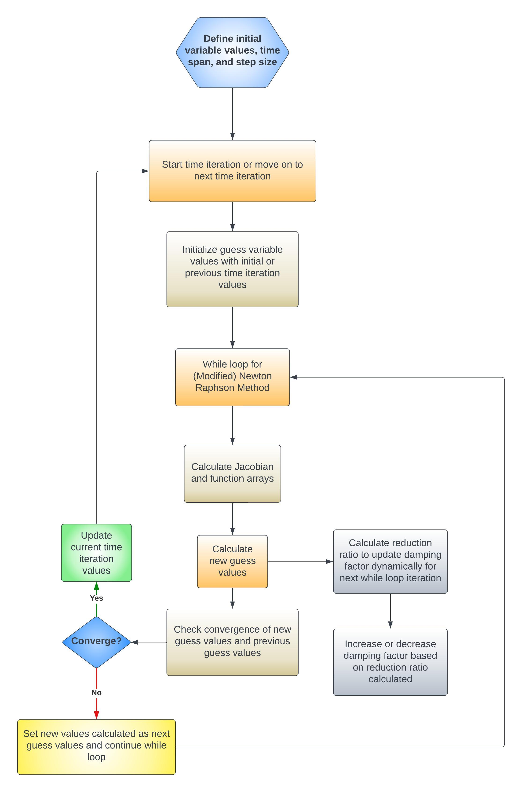
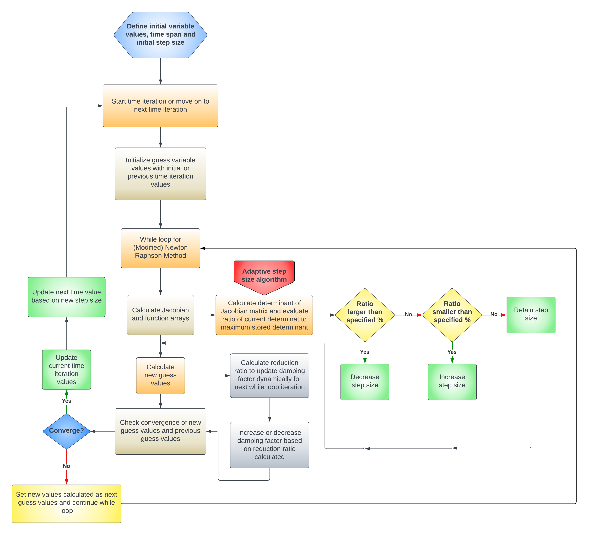
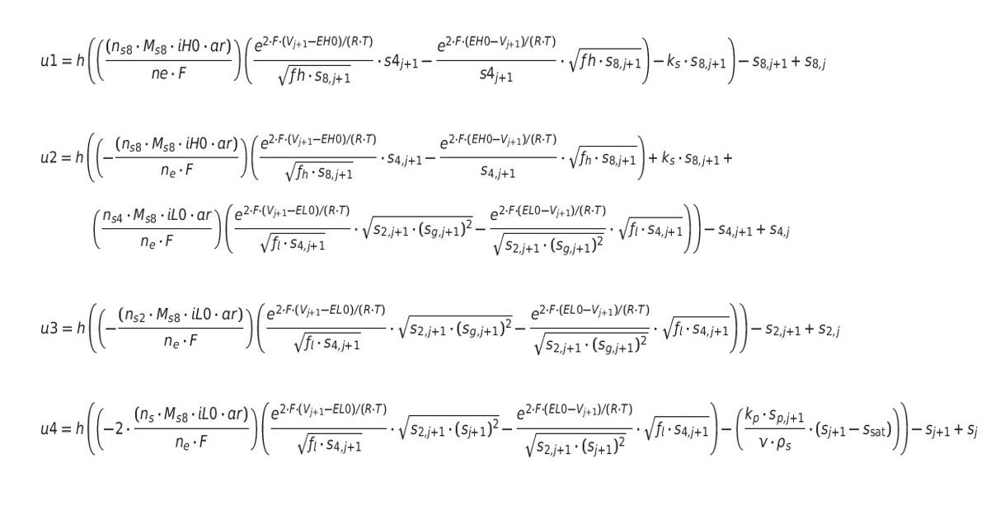
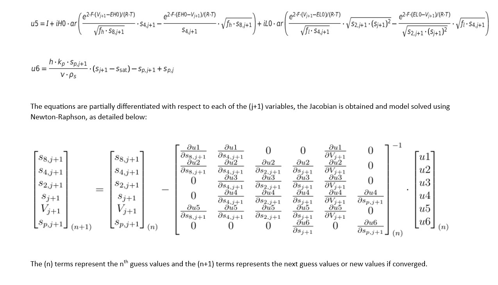

# FUSE_Li-S_Battery_Modelling
This repository will contain the numerical code for modelling Li-S batteries (WIP).


* The Base model solver code flow is given below:
 


* The Adaptive Step Size model solver code flow is given below:
 


* The Optimized Parameter Backtracking model solver code flow is given below:
 _New.png)


* Mathematical formulation of the model is as below (This was based on an older 2016 Mathematical formulation):
 
 


* Please refer to the ```Model_Documentation.pdf``` document in the ```Documentation``` folder for more info on the models and various hyper-parameters.
